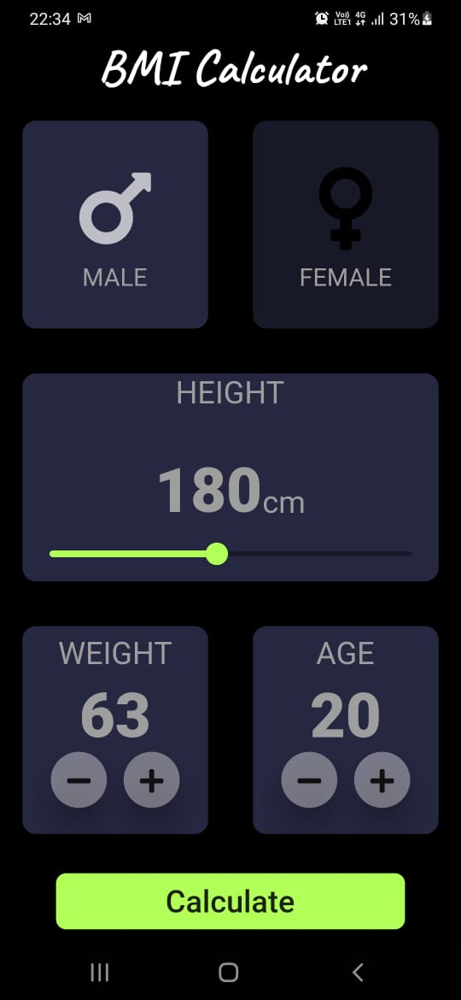

# BMI Calculator
### for running this app you have to install Flutter in your system `https://flutter.dev/docs/get-started/install`
### Main file you will find out in `lib` folder with `First_page.dart` name.

## Demo
  