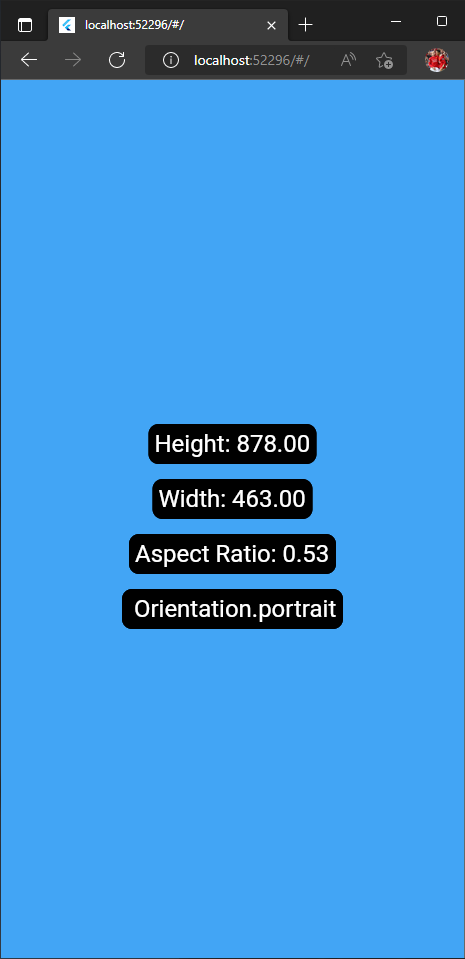

# Mediaquery Widget - App

A simple app demonstrating the use of mediaquery widget in flutter.

## App Overview 

## Some info about Mediaquery widget 
MediaQuery provides a higher-level view of the current app's screen size and can also give more detailed information about the device and its layout preferences.

## Usage 
- MediaQuery.of(context).size.height = this will get the height of your screen
- MediaQuery.of(context).size.width = this will get the width of the device screen 
- MediaQuery.of(context).size.aspectRatio = this will get the aspect ratio of the device screen 
- MediaQuery.of(context).orientation = provides the orientation of the screen, either landscape or portrait

## Tip 
Run the app with chrome/edge so that you can easily resize the size of the app window.