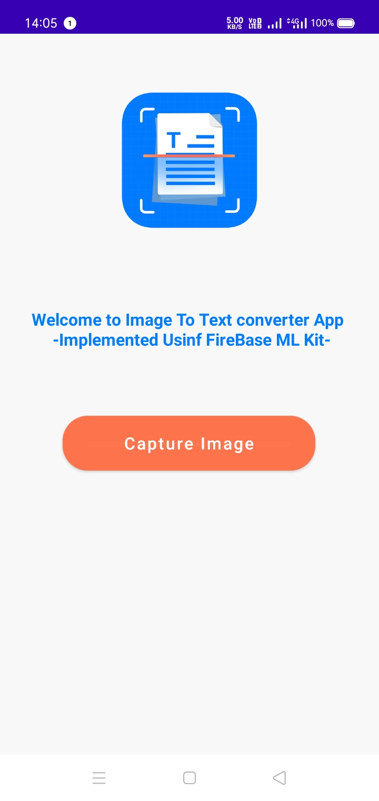
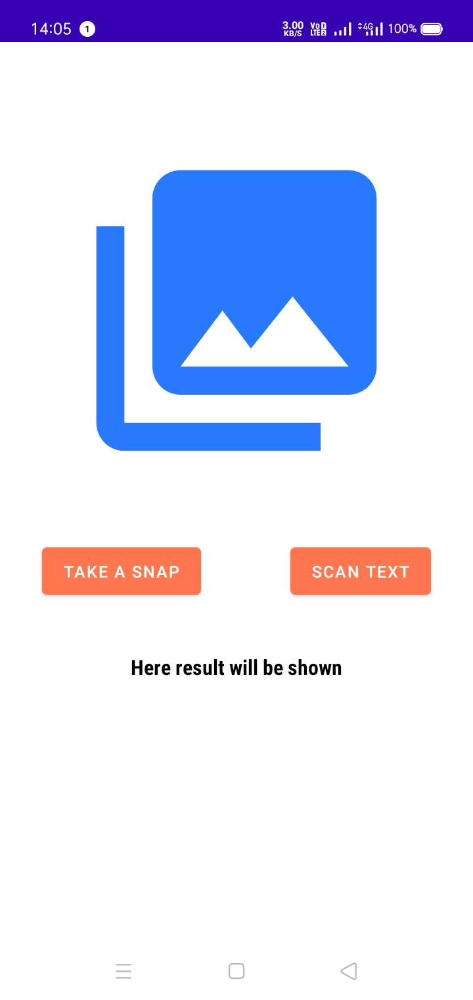
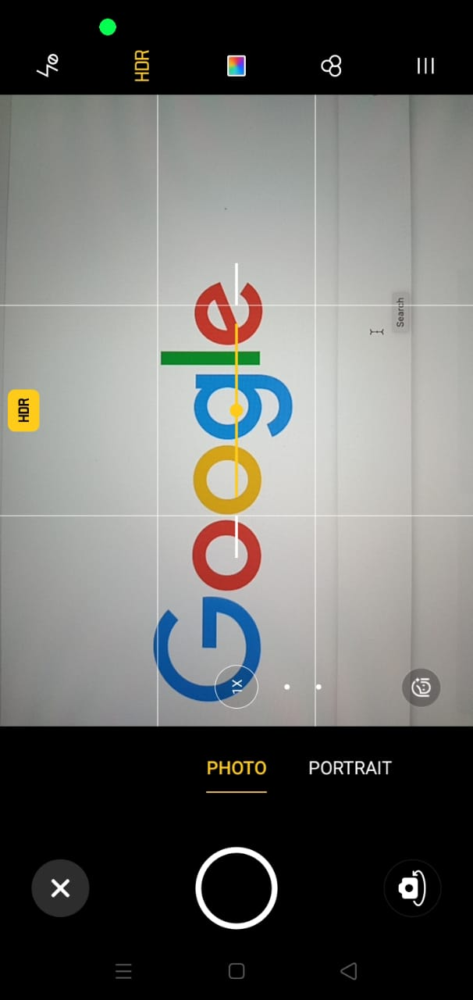
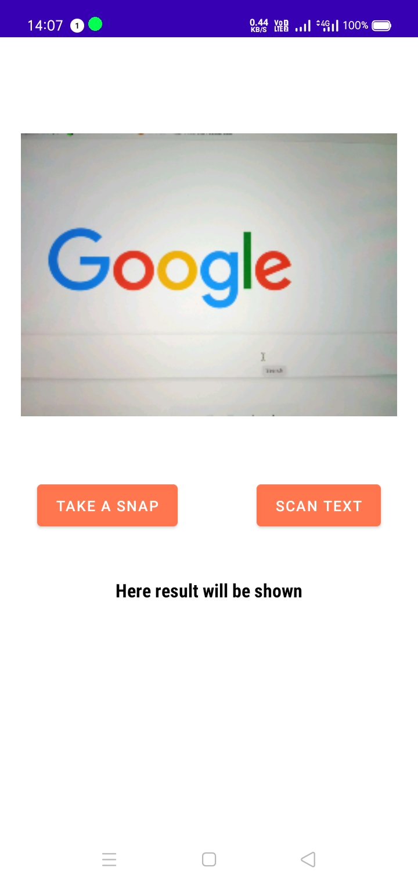
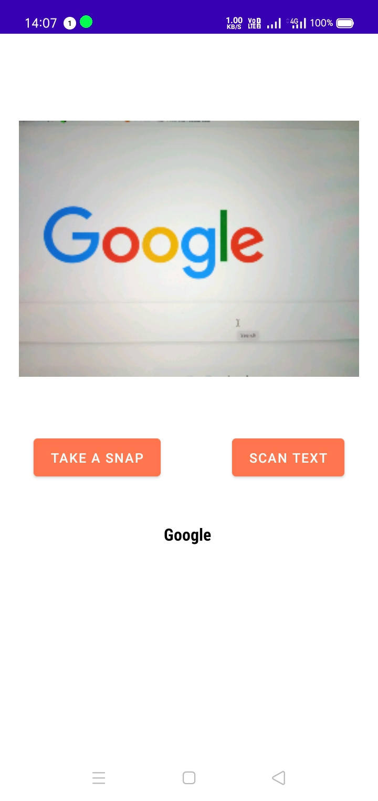
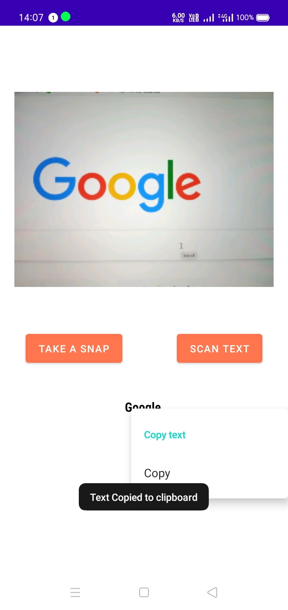

Image 2 Text App
===============

A sample Android  application built using Google FireBase ML Kit on the Android platform.
<p>
User can click pictures of handwritten text or Typed Text and this app helps to extract the textual contents from it


Overview
---------

<div align="center">
  <p float="left">
    
    
    
    
 </p>
</div>
<div align="center">
  <p float="left">
    
    
    
 </p>
</div>

Getting Started
---------------

```
git clone https://github.com/aadityamp01/Androapps.git
cd "Image2Text/Image2Text"
```

#### Requirements
  - [ ] `Android Studio`
  - [ ] `Android SDK 24 or later`
  - [ ] `camera permission`
### Dependencies 

```
//ml kit
    implementation 'com.google.android.gms:play-services-mlkit-text-recognition:18.0.2'
```


What would you learn
---------------------

  - [ ] Implementation of cameraX 
  - [ ] FireBase ML Kit
  - [ ] Navigation Componets
  - [ ] viewBinding in Java

