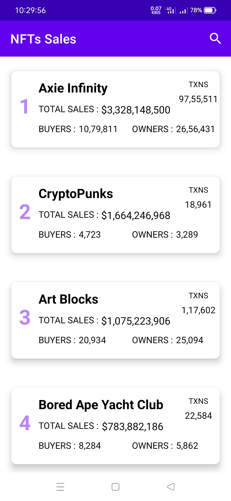
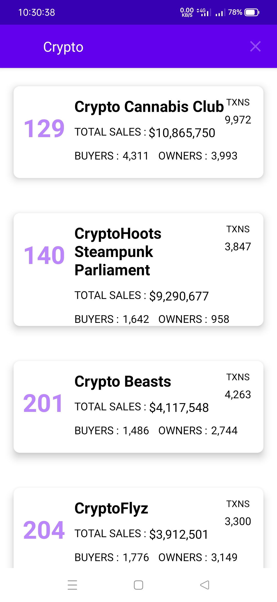
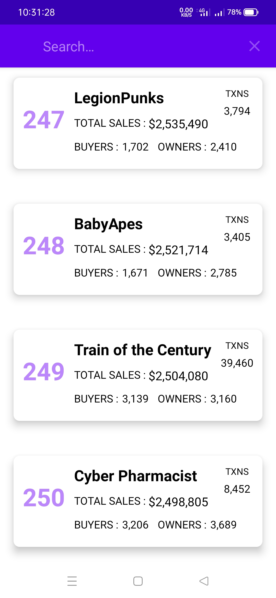

# NFTs SalesViewer App
Important demo application to prepopulate room database using external NFTs sales db file by implementing clean architechture. 

## Overview

  

    
    
    
 

### Instructions
1. Prepopulate room database - create entity, dao, database, repository
2. Create recyclerview adapter/ row_item
3. Create Main View model
4. This application uses dagger hilt dependency injection to get sqlite db file from assets and providing it to local room db

Note: If you get error about db, make all the coloumns in db as NonNull

## Requirements
1. Kotlin 
2. Android Version 5.0 and above
3. CompileSDKVersion 30
4. MinSDKVersion 21
5. Androidx
6. Plugins - kotlin-kapt, dagger.hilt

## What would you learn
1. Android Basics
2. Dagger Hilt
3. ViewModel, livedata, flow
4. Room Database (Jetpack Architecture Component) / SQLite DB
5. Recyclerview, SearchView
6. Implementation of External DB into android application(NFTs sales data)
