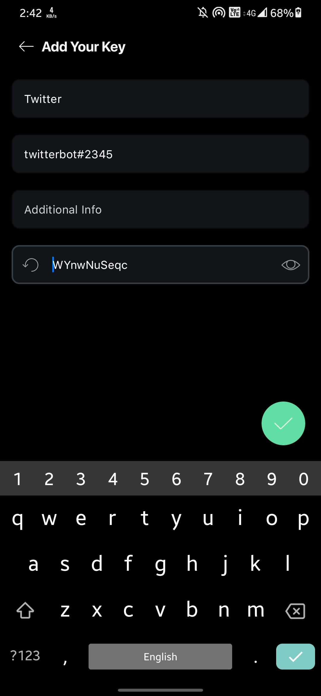
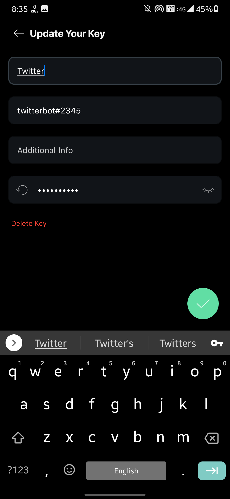

Password Manager
===============

A sample password manager application built using Kotlin on the Android platform.

Overview
---------

<div align="center">
  <p float="left">
    
    
    
    
 </p>
</div>

Getting Started
---------------

```
git clone https://github.com/aadityamp01/Androapps.git
cd "Password Manager/password-manager"
```

#### Requirements
  - [ ] `Android Studio`
  - [ ] `Android SDK 21 or later`
  - [ ] Working with Room/SQL database
### Dependencies 

```
apply plugin: "androidx.navigation.safeargs.kotlin"

def nav_version = "2.3.5"
classpath "androidx.navigation:navigation-safe-args-gradle-plugin:$nav_version"
```
```
//Room Database Implementation
implementation "androidx.room:room-runtime:2.3.0"
kapt "androidx.room:room-compiler:2.3.0"

// optional - Kotlin Extensions and Coroutines support for Room
implementation "androidx.room:room-ktx:2.3.0"}
```
