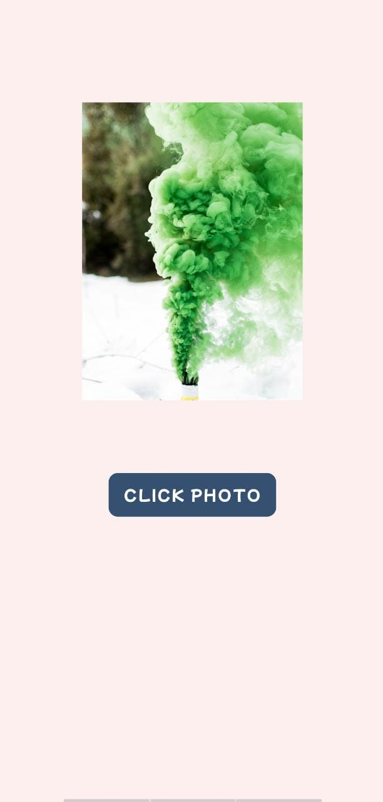

# PicClick
It is a picture clicking app, where you can click and save image to your phone.

## Technology Used
- Android
- Java

## Requirements
- Android Version 5.0 and above
- CompileSdkVersion 30
- MinSdkVersion 21
- targetSdkVersion 30
- Androidx
  
## Font Used
  - <a href="https://fonts.google.com/specimen/Mochiy+Pop+One?query=mochi">Mochiy Pop One</a>

## Pictures used
- Icon - <a href="https://storyset.com/work">Work illustrations by Storyset</a>
  
  

- Image view - Photo by <a href="https://unsplash.com/@jeisblack?utm_source=unsplash&utm_medium=referral&utm_content=creditCopyText">Jason Blackeye</a> on <a href="https://unsplash.com/s/photos/png?utm_source=unsplash&utm_medium=referral&utm_content=creditCopyText">Unsplash</a>

  

## Screenshots

