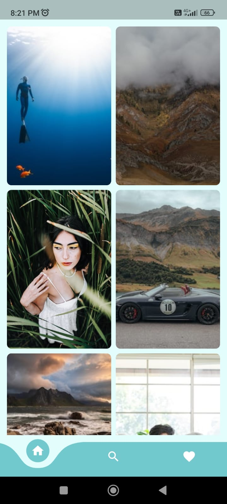
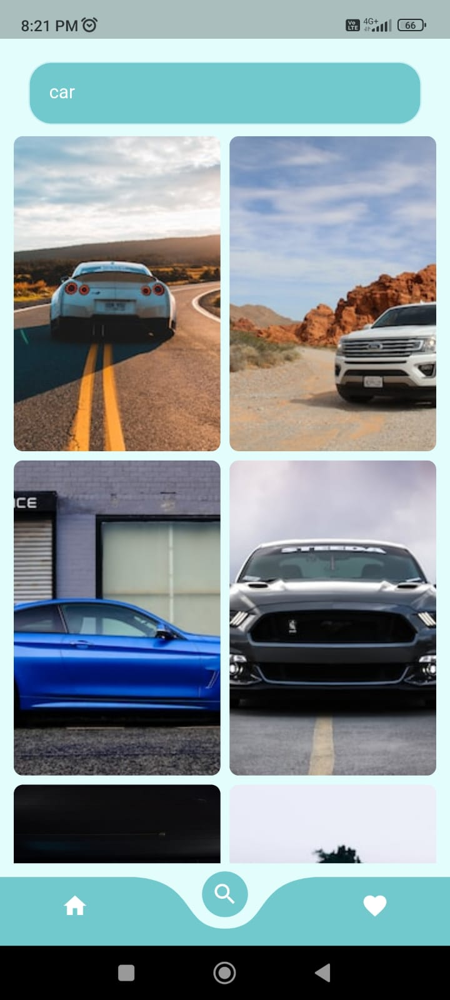
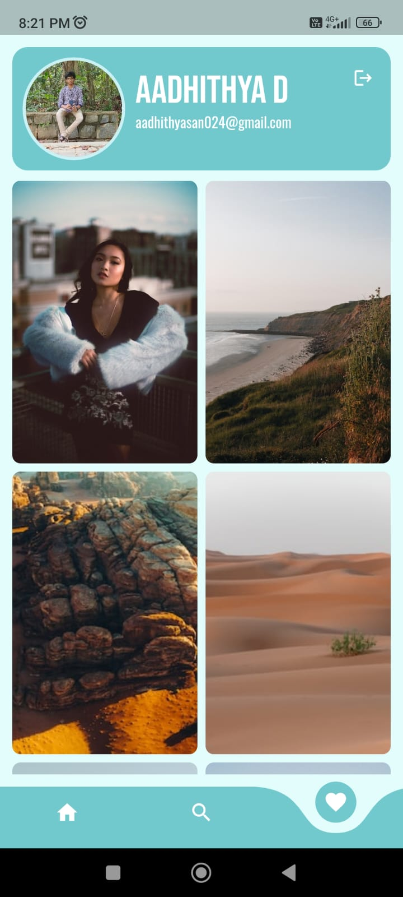
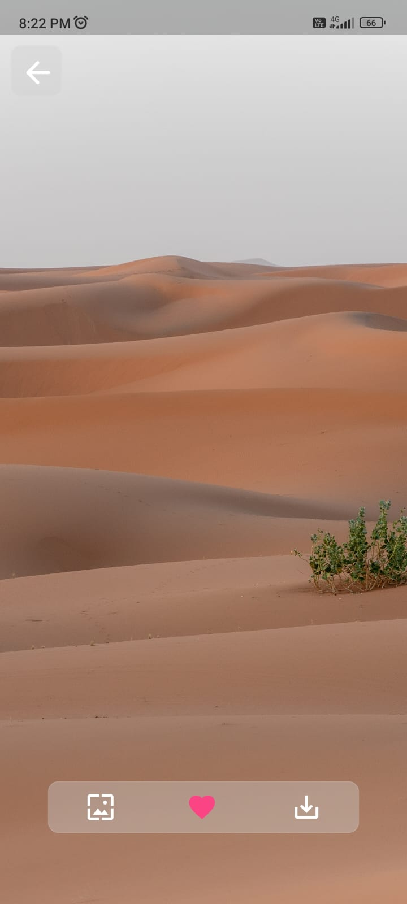

# Resplash - Wallpaper Selector App

Resplash is a versatile wallpaper selector application developed using the Flutter framework and powered by Firebase. The app provides users with the ability to discover, bookmark, download, and set their preferred wallpapers as device backgrounds. To offer an extensive range of wallpapers, Resplash seamlessly integrates with the Unsplash API.

## Features

Resplash comes with an array of features designed to enhance the user's wallpaper experience:

### Wallpaper Discovery

- **Unsplash Integration**: The app connects with the Unsplash API to fetch a vast collection of high-quality wallpapers for users to explore.

### User-Focused Functionality

- **Bookmarking**: Users can bookmark their favorite wallpapers for quick access.

- **Download**: Download wallpapers directly to their device for offline use.

- **Set as Wallpaper**: Easily set any selected wallpaper as the device's background.

- **Wallpaper Categories**: Organize wallpapers into categories for a more personalized experience.

## Getting Started

To get started with Resplash, follow these simple steps:

1. **Installation**: Install the app on your Android or iOS device from the respective app store.

2. **User Registration**: Create a user account to enable features like bookmarking and downloads.

3. **Discover Wallpapers**: Browse through the vast collection of wallpapers available through the Unsplash API.

4. **Bookmark, Download, and Set**: Simply tap the options to bookmark, download, or set a wallpaper as your device background.

5. **Enjoy**: Customize your device with beautiful wallpapers that resonate with your style and preferences.

## Technologies Used

Resplash utilizes the following technologies and frameworks:

- **Flutter**: The app's frontend is built with the Flutter framework, allowing for a consistent and visually appealing user interface across both Android and iOS platforms.

- **Firebase**: Firebase serves as the backend, providing user authentication, data storage, and cloud functions.

- **Unsplash API**: The Unsplash API is integrated to fetch an extensive collection of high-resolution wallpapers.

## Support and Feedback

We value your feedback and are here to assist with any questions or concerns. If you encounter any issues or have suggestions for improvements, please don't hesitate to contact our support team at [support@resplashapp.com](mailto:support@resplashapp.com).

## Acknowledgments

We extend our appreciation to the Unsplash team for providing a rich source of stunning wallpapers and to the Flutter and Firebase communities for enabling the development of this application.

Thank you for choosing Resplash to personalize your device with beautiful wallpapers!
