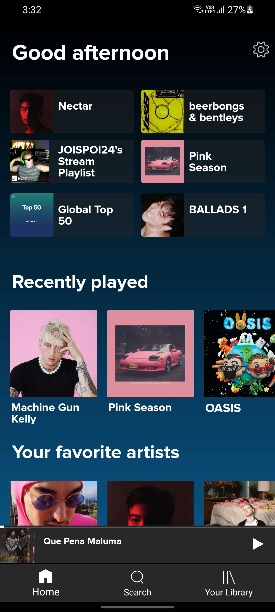
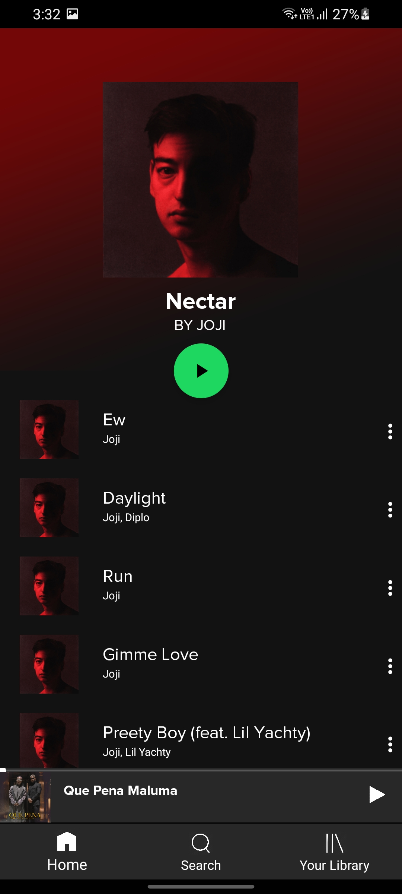

# Spotify UI Clone
  This is a UI clone of the Spotify Application

## Overview

<div align="center">
  <p float="left">
    
    
 </p>
</div>

Getting Started
---------------

```
git clone https://github.com/aadityamp01/Androapps.git
cd "Spotify UI Clone"
```

#### Requirements
  - [ ] `Android Studio`
  - [ ] `Android SDK 21 or later`
  
### Dependencies 
  -No dependencies required
  
What would you learn
---------------------  
  - [ ] How can you implement design into layouts
  - [ ] Excellent UI Designing
  - [ ] Use of themes and custom fonts
  - [ ] Use of fragments in android
  
