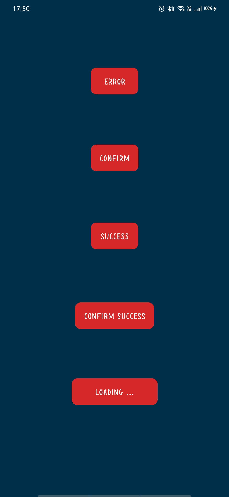

# SweetAlertDialog
It is App to display various dialogue boxes using SweetAlertDialog library.

## Technology Used
- Android
- Java
  
## Library Used
- [Sweet Alert Dialog](https://github.com/pedant/sweet-alert-dialog) 

## Requirements
- Android Version 5.0 and above
- CompileSdkVersion 30
- MinSdkVersion 21
- targetSdkVersion 30
- Androidx

## Screenshots

