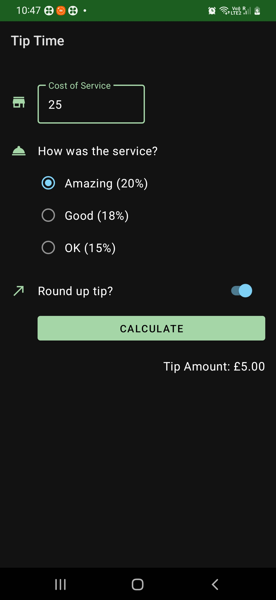
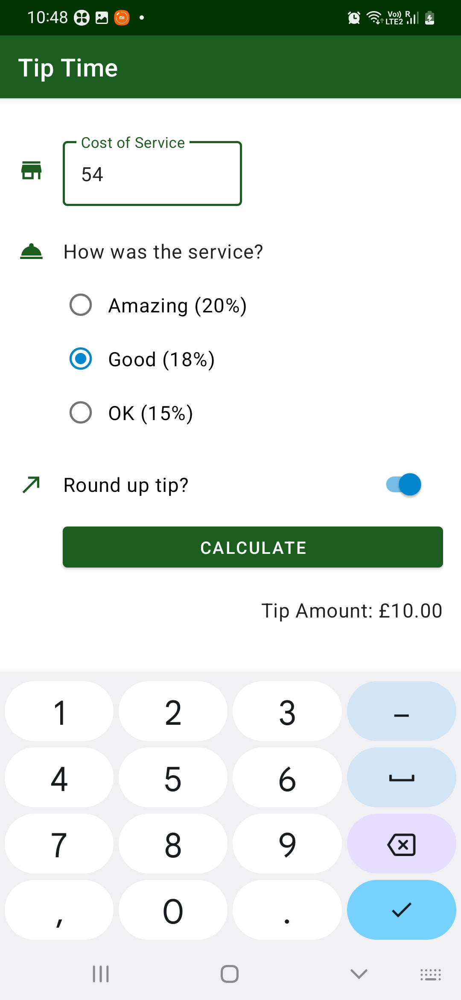
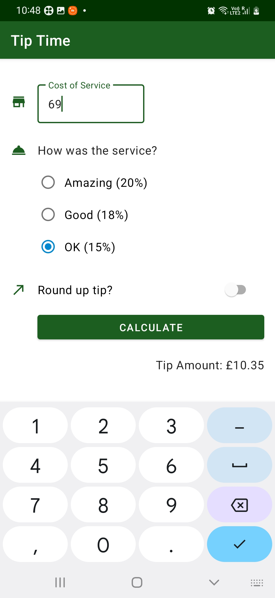

# Tip Calculator

A sample Tip Calculator to calculate the tip based on the service. Built using Kotlin on the Android Platform.


## OverView

#### Dark Mode


#### Light Mode





### Getting Started 

```
git clone https://github.com/aadityamp01/Androapps.git
cd "TipTime"
```

### Requirements
  - `Android Studio`
  - `Android SDK 21 or later`


What would you learn
---------------------

  - Implementing Icons based on your choice
  - Integrating BackEnd Calculation with FrontEnd
  - User Input in an App
