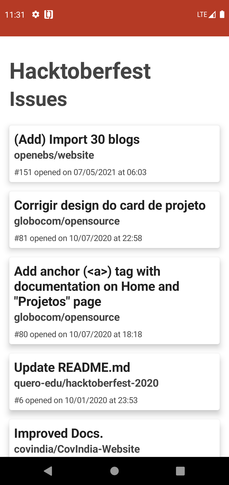

# Hacktoberfest Issues

**Hackberfest Issues App** lists the top recent issues with the `hacktoberfest` label on it, using [Github Search API](https://docs.github.com/en/rest/reference/search#search-issues-and-pull-requests). 

### Preview

### Libraries

- [Android Jetpack Compose](https://developer.android.com/jetpack/compose?gclid=Cj0KCQjwiNSLBhCPARIsAKNS4_eWOsLfm5zzxqGWS2Gn2SqCfS8_rVe0q7TVYfTM_Q-HjcUFIuk-zx0aAsUQEALw_wcB&gclsrc=aw.ds)
- [Kotlin Coroutines](https://kotlinlang.org/docs/coroutines-overview.html)
- [Retrofit](https://square.github.io/retrofit/)
- [Koin](https://insert-koin.io/) (for dependency injection)
- [ViewModel](https://developer.android.com/topic/libraries/architecture/viewmodel?gclid=Cj0KCQjwiNSLBhCPARIsAKNS4_eWJIoYuL5VSGqkV07iGORFuEUmjwFYniE1drTEW2Dn0f70x98D8HUaAhkwEALw_wcB&gclsrc=aw.ds)

### Upcoming features

- Save issues to your favorite list
- Personalize search filters
- Share issues with your friends
